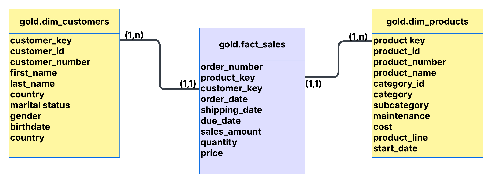

# Data Warehouse and Analytics Project

A comprehensive end-to-end data warehousing solution demonstrating modern data engineering best practices. This portfolio project showcases the complete data pipeline from raw source files to analytical-ready data models using PostgreSQL and the Medallion Architecture.

---

## 📋 Table of Contents

- [Project Overview](#-project-overview)
- [Architecture](#-architecture)
- [Features](#-features)
- [Project Structure](#-project-structure)
- [Data Model](#-data-model)
- [Getting Started](#-getting-started)
- [Data Transformations](#-data-transformations)
- [Quality Assurance](#-quality-assurance)
- [Naming Conventions](#-naming-conventions)
- [Technologies Used](#-technologies-used)
- [License](#-license)

---

## 🎯 Project Overview

This project demonstrates a production-grade data warehouse implementation that consolidates data from multiple source systems (ERP and CRM) into a unified analytical platform. The solution implements:

- **Modern Data Architecture**: Three-layer Medallion Architecture (Bronze, Silver, Gold)
- **Automated ETL Pipelines**: Stored procedures for data extraction, transformation, and loading
- **Star Schema Design**: Optimized dimensional model for analytical queries
- **Data Quality Framework**: Comprehensive validation and testing at each layer
- **Industry Best Practices**: Following enterprise data warehousing standards

### Business Context

The data warehouse consolidates sales data from two source systems:
- **ERP System**: Customer demographics, location, and product categorization
- **CRM System**: Customer information, product details, and sales transactions

This enables business users to perform cross-system analytics, generate insights, and make data-driven decisions.

---

## 🏗️ Architecture

The project implements the **Medallion Architecture** with three distinct layers:

### 1. Bronze Layer (Raw Data)
- **Purpose**: Stores raw data as-is from source systems
- **Data Source**: CSV files from ERP and CRM systems
- **Process**: Direct ingestion into PostgreSQL without transformation
- **Tables**: 6 tables mirroring source system structures

### 2. Silver Layer (Cleansed Data)
- **Purpose**: Cleansed, validated, and standardized data
- **Process**: Data quality rules, deduplication, and normalization
- **Transformations**:
  - Standardization of codes (gender, marital status, countries)
  - Handling missing and invalid values
  - Data type conversions
  - Duplicate removal
  - Derived columns calculation

### 3. Gold Layer (Business-Ready Data)
- **Purpose**: Business-level dimensional model (Star Schema)
- **Structure**: 
  - **Dimension Tables**: `dim_customers`, `dim_products`
  - **Fact Table**: `fact_sales`
- **Optimized for**: Analytical queries and business intelligence reporting

---

## ✨ Features

### Data Engineering
- ✅ Automated ETL pipelines using PostgreSQL stored procedures
- ✅ Incremental and full-load capabilities
- ✅ Data quality validation at each layer
- ✅ Error handling and logging mechanisms
- ✅ Performance-optimized transformations

### Data Quality
- ✅ Duplicate detection and removal
- ✅ Invalid data handling (future dates, negative values)
- ✅ Missing value imputation
- ✅ Data standardization and normalization
- ✅ Referential integrity checks

### Data Modeling
- ✅ Star schema implementation
- ✅ Surrogate key generation
- ✅ Slowly Changing Dimensions (Type 2) support
- ✅ Fact-dimension relationships
- ✅ Optimized for analytical queries



---

## 📂 Project Structure
```
data-warehouse-project/
│
├── datasets/                              # Source data files
│   ├── source_crm/                       # CRM system data
│   │   ├── cust_info.csv                # Customer information
│   │   ├── prd_info.csv                 # Product information
│   │   └── sales_details.csv            # Sales transactions
│   │
│   └── source_erp/                       # ERP system data
│       ├── CUST_AZ12.csv                # Customer demographics
│       ├── LOC_A101.csv                 # Location data
│       └── PX_CAT_G1V2.csv              # Product categories
│
├── scripts/                               # SQL scripts
│   ├── init_database.sql                 # Database initialization
│   │
│   ├── bronze/                           # Bronze layer scripts
│   │   ├── ddl_bronze.sql               # Table definitions
│   │   └── proc_load_bronze.sql         # Data loading procedure
│   │
│   ├── silver/                           # Silver layer scripts
│   │   ├── ddl_silver.sql               # Table definitions
│   │   └── proc_load_silver.sql         # Transformation procedure
│   │
│   └── gold/                             # Gold layer scripts
│       └── ddl_gold.sql                  # View definitions (Star Schema)
│
├── tests/                                 # Quality assurance
│   ├── quality_checks_bronze.sql         # Bronze layer validation
│   ├── quality_checks_silver.sql         # Silver layer validation
│   └── quality_checks_gold.sql           # Gold layer validation
│
├── data_model.png                         # Data model diagram
├── README.md                              # Project documentation
└── LICENSE                                # MIT License
```

---

## 📊 Data Model

### Gold Layer - Star Schema

#### Dimension Tables

**`gold.dim_customers`** - Customer Dimension

| Column           | Type         | Description                              |
|------------------|--------------|------------------------------------------|
| customer_key     | INT          | Surrogate key (Primary Key)              |
| customer_id      | INT          | Business key from CRM                    |
| customer_number  | VARCHAR(50)  | Alphanumeric customer identifier         |
| first_name       | VARCHAR(50)  | Customer first name                      |
| last_name        | VARCHAR(50)  | Customer last name                       |
| country          | VARCHAR(50)  | Country of residence                     |
| marital_status   | VARCHAR(50)  | Marital status (standardized)            |
| gender           | VARCHAR(50)  | Gender (standardized)                    |
| birthdate        | DATE         | Date of birth                            |
| create_date      | DATE         | Account creation date                    |

**`gold.dim_products`** - Product Dimension

| Column               | Type         | Description                              |
|----------------------|--------------|------------------------------------------|
| product_key          | INT          | Surrogate key (Primary Key)              |
| product_id           | INT          | Business key from CRM                    |
| product_number       | VARCHAR(50)  | Product identifier                       |
| product_name         | VARCHAR(50)  | Product name                             |
| category_id          | VARCHAR(50)  | Category identifier                      |
| category             | VARCHAR(50)  | Product category                         |
| subcategory          | VARCHAR(50)  | Product subcategory                      |
| maintenance_required | VARCHAR(50)  | Maintenance requirement flag             |
| cost                 | INT          | Product cost                             |
| product_line         | VARCHAR(50)  | Product line classification              |
| start_date           | DATE         | Product availability start date          |

#### Fact Table

**`gold.fact_sales`** - Sales Fact

| Column         | Type         | Description                              |
|----------------|--------------|------------------------------------------|
| order_number   | VARCHAR(50)  | Sales order identifier                   |
| product_key    | INT          | Foreign key to dim_products              |
| customer_key   | INT          | Foreign key to dim_customers             |
| order_date     | DATE         | Order placement date                     |
| shipping_date  | DATE         | Order shipment date                      |
| due_date       | DATE         | Payment due date                         |
| sales_amount   | INT          | Total sales amount                       |
| quantity       | INT          | Quantity ordered                         |
| price          | INT          | Unit price                               |

---

## 🚀 Getting Started

### Prerequisites
- PostgreSQL 12 or higher
- Database user with CREATE and WRITE permissions
- Sufficient storage for datasets

### Setup Instructions

Follow these steps to set up and run the data warehouse:

#### 1. Database Initialization
Navigate to `scripts/init_database.sql` to create:
- Database schemas (bronze, silver, gold)
- Initial database configuration
- Required extensions

#### 2. Bronze Layer Setup
**Table Creation**: Check `scripts/bronze/ddl_bronze.sql` for:
- Raw table structures matching source systems
- Column definitions for ERP and CRM data

**Data Loading**: Review `scripts/bronze/proc_load_bronze.sql` for:
- Stored procedure to load CSV files into bronze tables
- COPY commands for each source file
- Error handling and logging

#### 3. Silver Layer Setup
**Table Creation**: Check `scripts/silver/ddl_silver.sql` for:
- Cleansed table structures
- Additional columns for data quality

**Data Transformation**: Review `scripts/silver/proc_load_silver.sql` for:
- Data cleansing logic
- Standardization rules
- Transformation procedures

#### 4. Gold Layer Setup
**View Creation**: Check `scripts/gold/ddl_gold.sql` for:
- Star schema view definitions
- Dimension and fact table structures
- Business logic implementation

### Running the ETL Pipeline

Execute the stored procedures in sequence:
```sql
-- Step 1: Load raw data into Bronze layer
CALL bronze.load_bronze();

-- Step 2: Transform and load into Silver layer
CALL silver.load_silver();

-- Step 3: Query Gold layer (views automatically populated)
SELECT * FROM gold.dim_customers LIMIT 10;
SELECT * FROM gold.dim_products LIMIT 10;
SELECT * FROM gold.fact_sales LIMIT 10;
```

### Data Quality Validation

Run the quality check scripts located in the `tests/` folder:
- `quality_checks_bronze.sql` - Validates raw data integrity
- `quality_checks_silver.sql` - Verifies transformation accuracy
- `quality_checks_gold.sql` - Ensures star schema correctness

---

## 🔄 Data Transformations

### Bronze → Silver Transformations

#### Customer Data (`crm_cust_info`)
- **Whitespace Removal**: Trim leading/trailing spaces
- **Standardization**: 
  - Marital Status: `S` → `Single`, `M` → `Married`
  - Gender: `F` → `Female`, `M` → `Male`
- **Deduplication**: Keep latest record per customer ID
- **Missing Values**: Default to `n/a` for unknown values

#### Product Data (`crm_prd_info`)
- **Derived Columns**: 
  - Extract `category_id` from product key
  - Calculate `prd_end_dt` using window functions
- **Standardization**: Product line codes to descriptive names
- **Missing Values**: COALESCE cost to 0
- **Type Conversion**: String dates to DATE type

#### Sales Data (`crm_sales_details`)
- **Data Validation**:
  - Invalid dates (0 or wrong format) → NULL
  - Recalculate sales amount if inconsistent
  - Derive price if missing or invalid
- **Quality Rules**: 
  - `sales_amount = quantity × price`
  - Handle division by zero scenarios

#### ERP Customer Demographics (`erp_cust_az12`)
- **ID Cleansing**: Remove `NAS` prefix from customer IDs
- **Date Validation**: Future birthdates → NULL
- **Standardization**: Gender values normalized

#### ERP Location (`erp_loc_a101`)
- **ID Cleansing**: Remove hyphens from customer IDs
- **Country Standardization**: 
  - `DE` → `Germany`
  - `US`, `USA` → `United States`
- **Missing Values**: Blank countries → `n/a`

### Silver → Gold Transformations

#### Dimension Tables
- **Surrogate Keys**: Generate sequential keys using `ROW_NUMBER()`
- **Data Integration**: Join CRM and ERP sources
- **Column Renaming**: Business-friendly names
- **Current Records**: Filter active products only (`prd_end_dt IS NULL`)

#### Fact Table
- **Foreign Keys**: Link to dimension surrogate keys
- **Grain Definition**: One row per sales order line item
- **Metric Calculations**: Sales amount, quantity, price

---

## ✅ Quality Assurance

The project includes comprehensive data quality checks at each layer:

### Bronze Layer Checks
- Row count validation
- NULL value detection
- Duplicate identification
- Data type verification

### Silver Layer Checks
- Transformation accuracy
- Business rule validation
- Referential integrity (preliminary)
- Data completeness

### Gold Layer Checks
- Dimensional integrity
- Fact-dimension relationships
- Aggregate reconciliation
- Star schema validation

---

## 📝 Naming Conventions

### General Principles
- **Format**: snake_case (lowercase with underscores)
- **Language**: English only
- **Reserved Words**: Avoid SQL reserved keywords

### Layer-Specific Patterns

| Layer  | Pattern                  | Example          |
|--------|--------------------------|------------------|
| Bronze | `<source>_<entity>`      | `crm_cust_info`  |
| Silver | `<source>_<entity>`      | `erp_loc_a101`   |
| Gold   | `<type>_<entity>`        | `dim_customers`, `fact_sales` |

### Object Types

| Object              | Pattern            | Example          |
|---------------------|--------------------|------------------|
| Surrogate Keys      | `<entity>_key`     | `customer_key`   |
| Technical Columns   | `dwh_<purpose>`    | `dwh_load_date`  |
| Stored Procedures   | `load_<layer>`     | `load_bronze()`  |

---

## 🛠️ Technologies Used

- **Database**: PostgreSQL 12+
- **ETL Tool**: PL/pgSQL (Stored Procedures)
- **Data Modeling**: Star Schema (Dimensional Modeling)
- **Architecture**: Medallion Architecture
- **Version Control**: Git

---

## 🎓 Key Learning Outcomes

This project demonstrates proficiency in:

1. **Data Warehousing**: Multi-layer architecture design and implementation
2. **ETL Development**: Complex data transformations and pipeline automation
3. **Data Modeling**: Star schema and dimensional modeling techniques
4. **SQL Programming**: Advanced SQL, window functions, CTEs, stored procedures
5. **Data Quality**: Validation frameworks and testing strategies
6. **Best Practices**: Naming conventions, documentation, code organization

---

## 🤝 Contributing

This is a portfolio project, but suggestions and feedback are welcome! Feel free to:
- Open an issue for bugs or suggestions
- Fork the repository and experiment
- Share your own implementation ideas

---

## 📧 Contact

**Your Name**
- GitHub: [@yourusername](https://github.com/yassers25/)
- LinkedIn: [Your Profile](https://www.linkedin.com/in/yasser-salhi-46592828b/)
- Email: yassersalhi017@gmail.com

---

## 🛡️ License

This project is licensed under the [MIT License](LICENSE). You are free to use, modify, and distribute this project with proper attribution.
